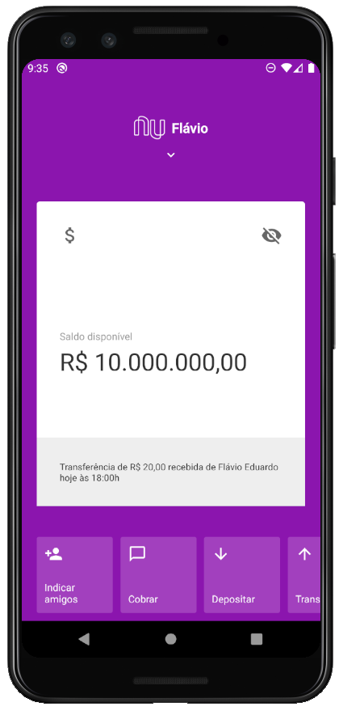
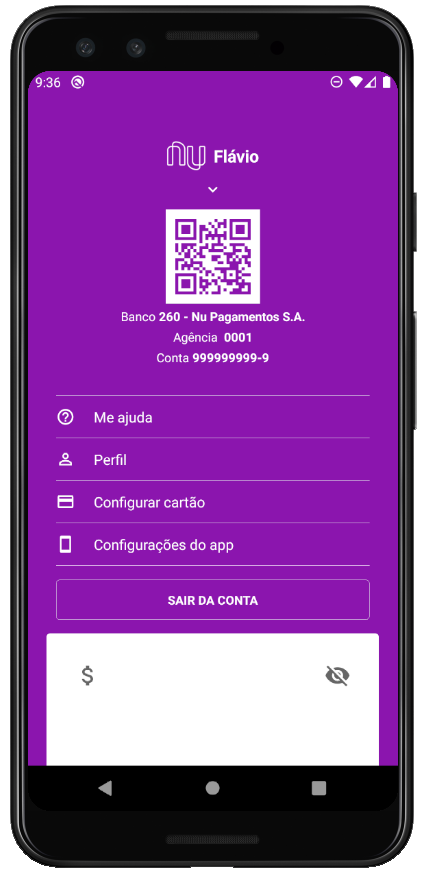

## Sobre o Projeto

Este projeto visa a recriação da interface do aplicativo Nubank utilizando React Native, baseado em um vídeo da Rocketseat.

## Por que utilizei React Native?

Pelo fato de eu ter uma familiaridade com a linguagem JavaScript, procurei uma forma de implementar um projeto mobile de modo que fosse ter um aprendizado mais rápido. Então encontrei o React Native, onde pude implementar de forma rápida e fácil um projeto tanto para iOS quanto para Android, e achei isso fascinante, tanto pela curva de aprendizado que essa biblioteca fornece, quanto pela praticidade em de se obter um sistema multiplataforma, utilizando-se do mesmo código para rodar em sistemas diferentes.

## Fotos do Projeto Desenvolvido




## Recursos Utilizados no Desenvolvimento

Com essa recriação da interface, pude aprender e utilizar muitos recursos importantes que poderão ser utilizados em inúmeros projetos posteriormente, como por exemplo:

* [x] Styled Components para facilitar a estilização dos componentes.
* [x] Fragmentation para retornar múltiplos elementos.
* [x] React Native Gesture Handler para tratar as interações do usuário, de acordo com o gesto que ele executar na aplicação.
* [x] API Animated para utilizar funções de animação nos elementos.
* [x] Geração de QRCodes.
* [x] O uso de States e Props.

## Como Executar o Projeto

Tendo a biblioteca do React Native já instalada e configurada no computador, basta apenas executar os seguintes comandos:

```
npm start
npm run android ou npm run ios
```
O segundo comando vai diferenciar de acordo com o sistema em que você queira executar, sendo Android ou iOS, e eles serão executados ou por um emulador instalado em sua máquina ou pelo próprio smartphone, caso esteja conectado ao computador e esteja habilitado o modo Desenvolvedor.

## Conclusão

Este projeto é um dos primeiros que realizo com React Native e adquiri muito conhecimento, com todos os recursos utilizados nesse desenvolvimento.
Irei utilizar todos os recursos que aprendi, junto com muitos outros que irei estudar para desenvolver projetos maiores e obter o máximo de potencial que essa biblioteca proporciona.


